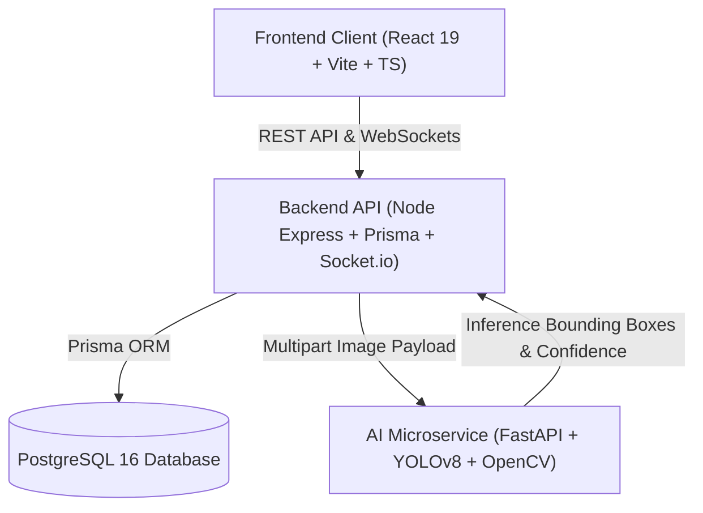

# SafeRoad 🛣️

**SafeRoad** is an open-source, AI-powered pothole detection, reporting, and municipal workflow management platform designed to improve road infrastructure and civic safety.

---

## 🏗️ Architecture Overview

SafeRoad is designed as a decoupled, microservices-based system:



### Microservices Breakdown

1. **Frontend (`frontend/`)**:
   * Built with **React 19**, **Vite**, **TypeScript**, and **Tailwind CSS**.
   * Role-based interfaces for Citizens (report submission, status tracking), Municipal Officers (verification, assignment, repair status updates), and Administrators (analytics dashboards, officer performance).

2. **Backend (`backend/`)**:
   * Built with **Express**, **TypeScript**, and **Prisma ORM**.
   * Handles authentication (JWT & HttpOnly cookies), role-based access control, report lifecycle management, comment threads, real-time Socket.io notifications, and analytics endpoints.

3. **AI Service (`ai-service/`)**:
   * Built with **FastAPI**, **Uvicorn**, **PyTorch**, **OpenCV**, and **Ultralytics YOLOv8**.
   * Performs computer vision inference on uploaded road images, detects pothole bounding boxes, calculates severity ratings based on relative surface area, draws annotated bounding boxes, and returns structured detection payloads.

4. **Database (`postgres`)**:
   * **PostgreSQL 16** database managed via Prisma schema migrations.

---

## 🔄 System Flow & Service Communication

```
1. Citizen uploads pothole image & location details via Frontend.
2. Frontend sends request to Backend API (`POST /api/reports`).
3. Backend saves draft report in PostgreSQL DB.
4. Backend sends image payload to AI Service (`POST /api/detection/detect`).
5. AI Service runs YOLOv8 model, saves annotated image, and returns detection data.
6. Backend stores AIResult, auto-updates report status to `AI_VERIFIED`, and broadcasts WebSocket event to Officers/Admins.
7. Municipal Officer verifies report, assigns repair crew, and updates status to `IN_PROGRESS` -> `FIXED`.
```

---

## 🚀 Quick Start with Docker Compose

Run the entire SafeRoad system locally with a single command:

```bash
docker compose up --build
```

### Service Endpoints

| Service | Local URL | Description |
| :--- | :--- | :--- |
| **Frontend Web App** | `http://localhost:5173` | React web portal for Citizens & Officers |
| **Backend API** | `http://localhost:8000/api` | Express REST API & WebSockets |
| **Backend Health** | `http://localhost:8000/health` | Backend status check |
| **AI Microservice Docs** | `http://localhost:8001/docs` | FastAPI Swagger documentation |
| **PostgreSQL DB** | `localhost:5432` | Relational database (User: `postgres`, DB: `saferoad`) |

---

## 💻 Local Development Setup (Without Docker)

### 1. Prerequisites
* Node.js v20+
* Python 3.11+
* PostgreSQL 16+

### 2. Database & Backend
```bash
cd backend
npm install
cp .env.example .env
# Set DATABASE_URL and JWT_SECRET in .env
npx prisma db push
npm run dev
```

### 3. AI Service
```bash
cd ai-service
python -m venv venv
# Windows: venv\Scripts\activate | Linux/macOS: source venv/bin/activate
pip install -r requirements.txt
uvicorn main:app --host 0.0.0.0 --port 8001 --reload
```

### 4. Frontend
```bash
cd frontend
npm install
cp .env.example .env
npm run dev
```

---

## 🧠 AI Model Training Guide

The AI microservice includes a model loader (`ai-service/app/core/model_loader.py`) that loads custom weights from `ai-service/models/best.pt`. If custom weights are missing, it automatically loads `yolov8n.pt` as an active placeholder.

To train a custom YOLOv8 model on a public pothole dataset:

1. Download a dataset in **YOLOv8 PyTorch** format (e.g., from [Roboflow Universe Pothole Dataset](https://universe.roboflow.com/roboflow-100/pothole-detection-v2)).
2. Extract the dataset into `ai-service/dataset/` so that `dataset/data.yaml` exists.
3. Run the training script:
   ```bash
   cd ai-service
   python scripts/train_pothole_yolo.py
   ```
4. The script trains YOLOv8 Nano for 50 epochs and copies the output weights to `ai-service/models/best.pt`.

---

## 🧪 Testing & CI

### Run Backend Integration Tests
```bash
cd backend
npm test
```

### Run Frontend Typechecks & Build
```bash
cd frontend
npx tsc --noEmit
npm run build
```

SafeRoad uses **GitHub Actions** (`.github/workflows/ci.yml`) to automatically validate TypeScript compilation, run database integration tests against PostgreSQL, and verify Python syntax on every pull request.

---

## ⚠️ Known Limitations & Roadmap

1. **AI Model Weights**: In initial setup, default `yolov8n.pt` operates as a placeholder model until fine-tuned `models/best.pt` is placed in `ai-service/models/`.
2. **Offline Mode**: Client-side offline caching for mobile connectivity loss in remote rural roads is currently under active development.
3. **Heatmap & Spatial Analytics**: Advanced spatial density clustering algorithms for municipal budget optimization are planned for future releases.

---

## 📄 License

This project is open-source and licensed under the **[MIT License](LICENSE)**.
